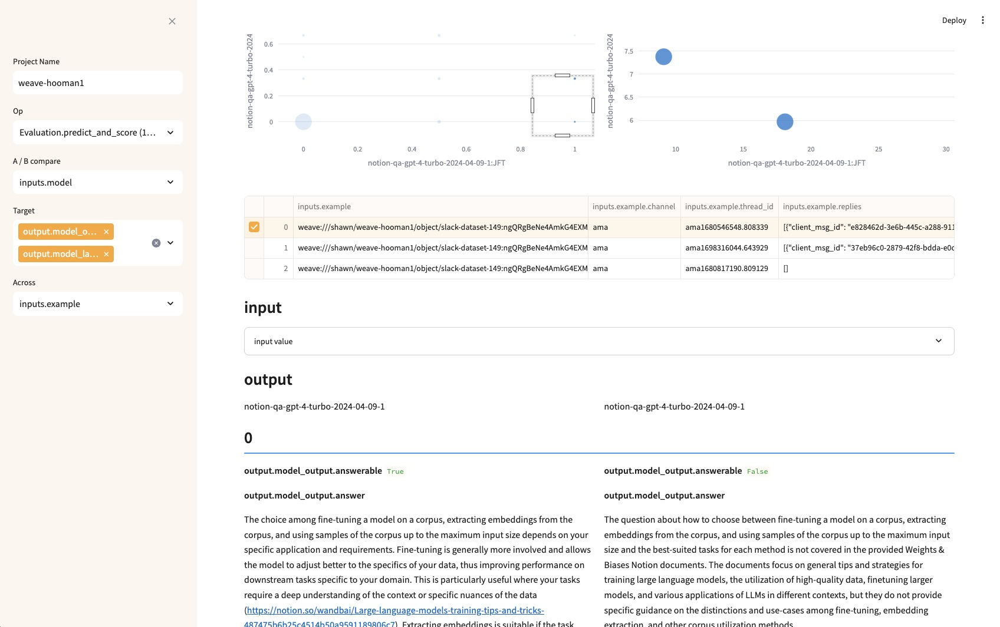

# weave-analysis

This repo has useful tools for working with Weave data. Its an experimental area for us to work on finding the right patterns to build into Weave itself.


## st_app_eval.py

A streamlit based UI for analzying and comparing Weave data, especially evaluation results.

```
pip install weave streamlit pandas
streamlit run st_app_eval.py
```



